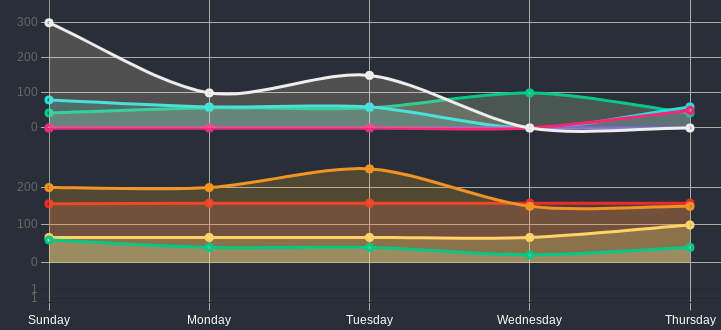
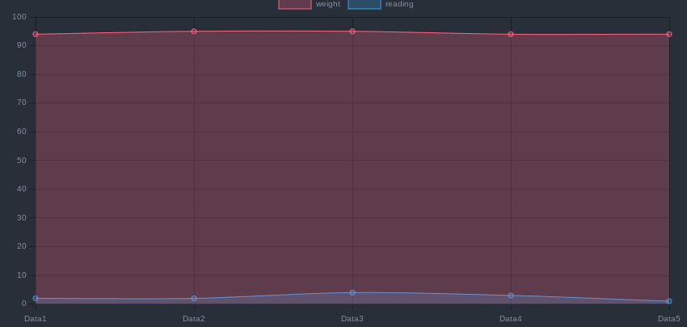
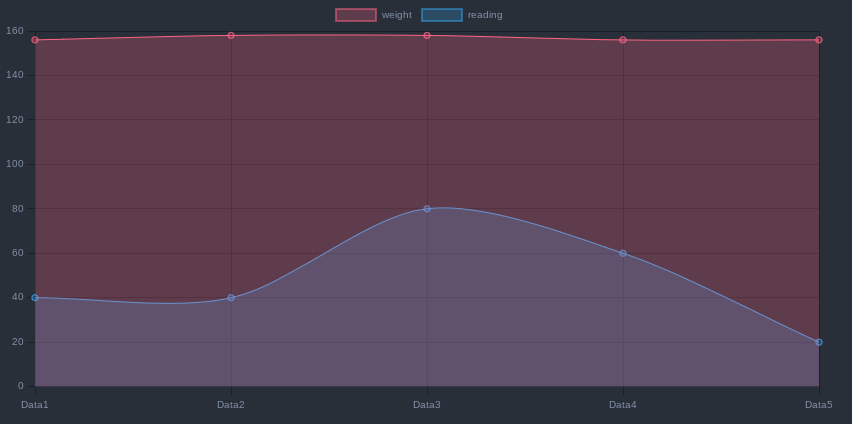

> [!warning]
> Things might change in the future.
> the setup is might change in the future, as I'm still trying to make it more simple, easier to understand and easier to modify.

# Introduction

This documentation should cover all the important variables and terminology so that you can easily customize your habit tracking visualizationn. 

IF something is not explained here, please make an issue, and I'll Work on it as soon as possible 

> [!note]
> 
> All files mentioned here are Javascript files
> You don't have to have a total understanding of JavavSciprt  but it will make ur life much easier working with this document

## Graph Display
This can be found in the [/90-CustomJS/00-Defaults.js](../90-CustomJS/00-Defaults.js) file. 

To understand how to customize these data you have to check [ChartJS](https://www.chartjs.org/) documentation, if you want to add more custom values.

This also requires that you have the [Obsidian-charts](https://github.com/phibr0/obsidian-charts) plugin installed, and also check the [documentation](https://charts.phibr0.de/Meta/Charts/Obsidian+Charts+Documentation) for better understanding of how it works.
### Sections 
This specifies how to display, or what kind of values does the graph is going to display. 
It contains information much of the whole canvas the chart is going to take, the position of the labels, and if it going to stack on top of other section or not
There are only 3 options currently : 
- Y axies options 
	- Check : Display Categorical values "true or false" small space on Chart
- Value : used in variables that contain numerical values. 
	- Values : Display Numerical values, takes a large space on the chart depending.
- X axies options
	- x : basic display settings for the x axis to show labels, and borders for those labels. 

### Chart
Specify on what type of chart the value is going to be displayed and contains basic minimal information that is going to be needed to display the information of a specific variable in the chart.

- Check : used in variables that contain categorical values

### animation and transition 
Settings for how to animation the charts, on hide and show conditions

### plugins
Information about where to display legend elements, and tool tip functions, and if it allows stacking or not.

### Colors
have 2 lists of colors to display the data
It keeps looping through the list of colors until it apply colors to all the data. 
- background : colors for the background of the data curve.
- border : colors for the border of the data curve. 

## Data 

### Yaxies 
Specifies how many stacks/layers Y  of axes will  be displayed  and what type they will be 

> [!note]
> 
> to display 3 stacks of Y axes
> ```js
> Yaxises = {
> y 			: "check",
> y2			: "check",
> y3			: "Value",
> y4			:  "Value",
> }
> ```




### Properties
A list/Array of objects that contain important information about what values to look for, and how to display them.

> [!note]
> Order Matters
> The order of how objects are places, is the order of how the data is going to be displayed, layered or stack on top of each other. 

Each object in the List/ Array have to specify what the variable to look for, whether to store the values as a sum of all values or as the average of the values, what Y/X axes it should be displayed on, what stack it is displayed on, and what is the Target value to measure the actual value against. 


> [!note]
> 
> [Yaxises object](#Yaxies) values and [Propeties](#Properties) values have to be edited per file in the current state.
> current files are :
> 
> - [90-CustomJS/01-DialyCharts.js](../90-CustomJS/01-DialyCharts.js)
>   
> - [90-CustomJS/02-WeeklyCharts.js](../90-CustomJS/02-WeeklyCharts.js)
>   
> - [90-CustomJS/03-MonthlyCharts.js](90-CustomJS/03-MonthlyCharts.js)


#### Label
It is the name of the variable that the script is going to look for in metadata of files we are going through.

#### Target
measures the real value against the expected value. 
this is used so that the graph display data in a more understandable form, and to avoid the problem of displaying very high values along with very low values. 

The data displayed in the graph, is going to be the percentage of the real value compared to the target value. 

> [!note]
> Set a target of how many hours of read I expect to do, and my weight for the week.
> ```JS
> properties=[
> {
>	label		: 'reading',
>	Target		: 5,
> },
> {
>	label		: 'weight',
>	Target		: 60,
> }
> ]
> ```
> let's imagine that we have those values 
> ```js
> weight : 94 , 95 , 95 , 94 , 94
> reading : 2 , 2 , 4 , 3 , 1
>```

 

>[!note]
> this makes it harder to understand the graph, so instead we compare those values to the target and display them in the same Y-axies
> it is much easier to understand the graph




#### Scatter
specifies the style it will display data in for more information check [ChartJS](https://www.chartjs.org/).

#### chart
What type of value to expect from the variable weather its a Numerical or Categorical 
take the values that are found in [|The Charts](#Chart) object. 

#### yAxisID
specifies the Y axes layer it will be displayed in those values should match the the values in the [|Yaxises object](#Yaxies)

current setups


### Average
this property tells the script to write this value's average in the current file instead of writing the total of the value, a good example for this is that I would want to know my average weight for the current week/month, not the total value of my weight. 

takes either : `true` or `false` value

## Displaying charts 
I already have 3 templates that have the necessary data to track days by weeks, weeks by months, and months by days. 
But I know Not every one is going to use the same setup so here I'll attempt to explain how the code block works.

The raw setup should look something like this.

Currently, for this to work it has to be a `dataviewjs` code block, and you have to call functions with the `customJS` plugin, and you have to call specific functions from specific classes, one for displaying Daily notes information, one for displaying weekly notes information and one for Monthly notes information. 

You can display a year's data either by daily notes, or weekly notes, or monthly notes. 
the reason I made it this way ; is to provide different options, but also to avoid overcrowding the charts with data points and labels. 

- A Year can be display months data, weeks data, or days data.
- A month can be display weeks data, or days data.
- A week can only display days data.

And Just to stay safe I'll include a setup example for all those cases with comments in the setup code to explain what  needs to be explained 


### Displaying Week data
> [!note]
> List/Display data for the week by days
>
>```JS
>/// script should be a dataview block
> customJS.DvDailyCharts.renderWeek({	
>	dv, // important to include the dataview plugin so it can gather data
>	block: this, // important to tell the script to draw the charts in the current code block
>	setValues: true, // Option to write the values into the current file 
>	
>	Date: "2020-W15", // Date we want to track
>	DateFormat: "YYYY-[W]ww", // Date Format 
>	DocumentFormat: "YYYY-MM-DD", // the date format  
>	labelFormat:"dddd", // date labels 
>	
>	group: "#diary",  // Files to look read, could be path or tag
>	types: { 
>	// Types of charts to display
>		"line" :  // display a line chart
>		{ 
>			stacked : true, // display stacked chart
>			target	: false, // measure data against target.
>		},
>		"bar" :  // display a bar chart
>		{ 
>			stacked : false,
>			target	: false,
>		},
>		"table" : // display a table 
>		{ 
>			stacked : false,
>			target	: true,
>		},
>	},
> })
> ```

### Displaying Months data
> [!note]
> List/Display data for the Month by days
>
>```JS
>/// script should be a dataview block
> customJS.DvDailyCharts.renderMonth({	
>	dv, 
>	block: this, 
>	setValues: true, 
>	
>	Date: "2020-01", 
>	DateFormat: "YYYY-MM", 
>	DocumentFormat: "YYYY-MM-DD",
>	labelFormat:"DD", 
>	
>	group: "#diary",  
>	types: { 
>		"line" : {
>			stacked : true,
>			target	: false, 
>		},
>		"bar" : { 
>			stacked : false,
>			target	: false,
>		},
>		"table" : { 
>			stacked : false,
>			target	: true,
>		},
>	},
>})
>```	


> [!note]
> List/Display data for the Month by weeks
>
>```JS
>/// script should be a dataview block
>customJS.DvWeeklyCharts.renderMonth({	
>	dv, 
>	block: this,
>	setValues: true, 
>	
>	Date: "2020-01",
>	DateFormat: "YYYY-MM", 
>	DocumentFormat: "YYYY-[W]ww", 
>	labelFormat:"YYYY-[W]ww", 
>	
>	group: "#Weekly", 
>	types: { 
>		"line" : {
>			stacked : true, 
>			target	: false, 
>		},
>		"bar" : { 
>			stacked : false,
>			target	: false,
>		},
>		"table" : {
>			stacked : false,
>			target	: true,
>		},
>	},
>})
>```	


### Displaying Years Data

> [!note]
> List/Display data for the Year by days
>
>```JS
>/// script should be a dataview block
>customJS.DvDailyCharts.renderYear({	
>	dv, 
>	block: this,
>	setValues: true, 
>	
>	Date: "2020", 
>	DateFormat: "YYYY", 
>	DocumentFormat: "YYYY-MM-DD", 
>	labelFormat:"MM-DD", 
>	
>	group: "#diary", 
>	types: { 
>		"line" : {
>			stacked : true, 
>			target	: false,
>		},
>		"bar" : { 
>			stacked : false,
>			target	: false,
>		},
>		"table" : { 
>			stacked : false,
>			target	: true,
>		},
>	},
>})
>```	


> [!note]
> List/Display data for the Year by weeks
>
>```JS
>/// script should be a dataview block
>customJS.DvWeeklyCharts.renderYear({	
>	dv, 
>	block: this, 
>	setValues: true, 
>	
>	Date: "2020", 
>	DateFormat: "YYYY",
>	DocumentFormat: "YYYY-[W]ww",
>	labelFormat:"[W]ww",
>	
>	group: "#Weekly",
>	types: { 
>		"line" : {
>			stacked : true, 
>			target	: false, 
>		},
>		"bar" : { 
>			stacked : false,
>			target	: false,
>		},
>		"table" : {
>			stacked : false,
>			target	: true,
>		},
>	},
>})
>```	


> [!note]
> List/Display data for the Year by Month
>```JS
>/// script should be a dataview block
>customJS.DvMonthlyCharts.renderYear({	
>	dv, 
>	block: this,
>	setValues: true,
>	
>	Date: "2020-01",
>	DateFormat: "YYYY-MM",
>	DocumentFormat: "YYYY-MM",
>	labelFormat:"MMMM",
>	
>	group: "#Monthly",
>	types: { 
>		"line" : {
>			stacked : true,
>			target	: false, 
>		},
>		"bar" : {
>			stacked : false,
>			target	: false,
>		},
>		"table" : {
>			stacked : false,
>			target	: true,
>		},
>	},
>})
>```	
